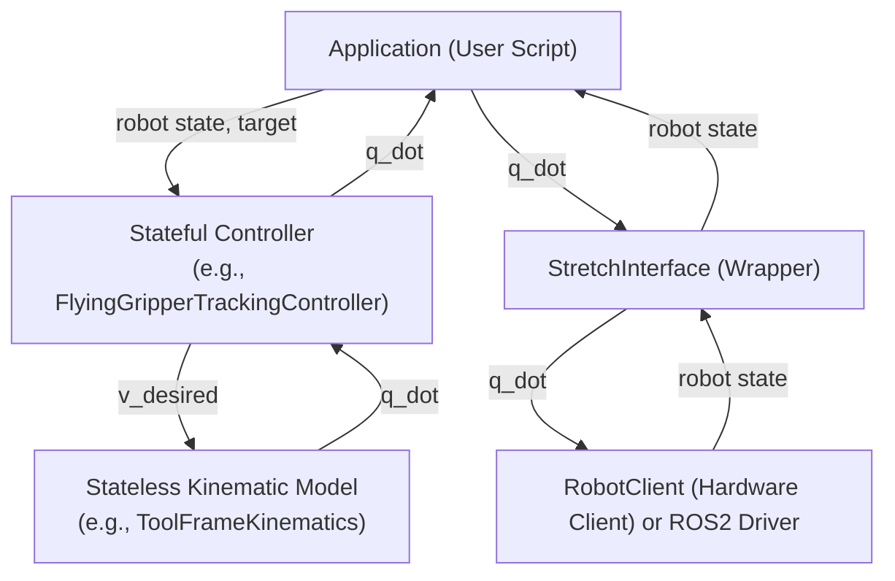
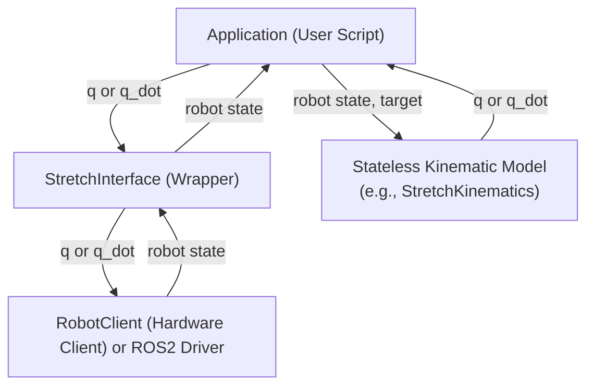

# stretch4_kinematics

A kinematics and task-space control library designed for the Hello Robot Stretch 4. This repository provides solvers for forward kinematics (FK) and numerical inverse kinematics (IK) using [Pinocchio](https://github.com/stack-of-tasks/pinocchio) under the hood, and includes wrappers/controllers to easily track Cartesian poses and control the physical or simulated robot.

---

## Table of Contents
1. [Overview & Intent](#1-overview--intent)
2. [Key Features](#2-key-features)
3. [Installation & Dependencies](#3-installation--dependencies)
4. [Getting Started (Quickstart)](#4-getting-started-quickstart)
5. [Architecture & Key APIs](#5-architecture--key-apis)
6. [Demos](#6-demos)

---

## 1. Overview & Intent

The primary purpose of `stretch4_kinematics` is to bridge the gap between high-level task-space goals (e.g., placing the gripper at a specific world-frame 3D coordinate $[X, Y, Z]$ with orientation $[R, P, Y]$) and the low-level joint/velocity commands sent to the Stretch 4 hardware. 

It provides:
*   **IK Solvers:** To find valid joint configurations matching a 6-DOF target pose.
*   **Task-Space Controllers:** To dynamically track interactive targets (such as task space "flying gripper" targets) using velocity-based differential IK control.
*   **Hardware Interface Wrapper:** High-level wrappers to query physical state and command the physical robot safely.

---

## 2. Key Features & Control Architecture

### Key Features
*   **Fast Pinocchio Backend:** Leverages Pinocchio's efficient rigid body dynamics algorithm for kinematics computation and Jacobian evaluation.
*   **Flexible Mobile Base Movement Modes:**
    *   `BASE_PLANAR`: 3-DOF mobile base representation ($x, y, \theta$).
    *   `BASE_ROTATE`: 1-DOF mobile base representation (rotation $\theta$ only, no translation). Used for standard localized IK.
    *   `BASE_FIXED`: 0-DOF mobile base (fixed in place).
*   **Weighted Jacobian Differential IK:** Resolves kinematic redundancy using weighted least-squares with automated joint-limit deceleration/repulsion.
*   **State Abstractions:** Dataclasses that automatically translate between Stretch 4 joint configuration conventions (8-DOF vector/dictionary) and Pinocchio-native configurations (9-element vector including the $SE(2)$ base pose in $(x, y, \cos\theta, \sin\theta)$ parametrization).

### Control & State Architecture
An application utilizing this library operates under one of two paradigms:

#### Paradigm A: Stateful Control (Option A)
The app instantiates a stateful **Controller** (e.g., `FlyingGripperTrackingController`) which internally handles PID states/integrals and instantiates its own stateless **Kinematic Model** to evaluate differential kinematics. The controller accepts current joint states and target poses, and computes output velocities (`q_dot`) which are sent to the robot interface.

Here is the data routing and control flow for Option A:



#### Paradigm B: Stateless Solver (Option B)
The app directly instantiates a stateless **Kinematic Model** (e.g., `StretchKinematics` or `ToolFrameKinematics`) to compute FK/IK on the fly. The app queries the current joint state, solves the position IK for a target pose, and commands the robot interface to move to the solved position configuration (`q`).

Here is the data routing and control flow for Option B:



---

## 3. Installation & Dependencies

Install this package in editable mode within your workspace:
```bash
uv pip install -e .
```

---

## 4. Getting Started (Quickstart)

Here are two quick examples demonstrating the core functionality of the package.

### Example 1: Solving 6-DOF Inverse Kinematics
This script loads the kinematic model, defines a target frame and target coordinate in the local robot frame, solves numerical IK, and outputs the resulting joint positions.

```python
import numpy as np
from stretch4_kinematics.kinematic_models import StretchKinematics

# Initialize the solver (automatically loads Stretch 4 URDF)
solver = StretchKinematics()

# Target frame name inside the URDF
target_frame = "grasp_center_link"

# Target position (x, y, z) in meters and orientation (roll, pitch, yaw) in radians
target_xyz = np.array([0.45, -0.15, 0.9])
target_rpy = np.array([0.0, 0.0, 0.3])

# Solve numerical IK starting from the neutral robot state
solved_joints = solver.inverse_6dof_local(
    target_frame=target_frame,
    target_xyz=target_xyz,
    target_rpy=target_rpy,
    q_guess=None  # defaults to neutral pose
)

print(f"For target {target_xyz.tolist()} with roll-pitch-yaw {target_rpy} in the robot's base frame...")
print("Solved joint positions:")
solved_joints.pretty_print()
```

### Example 2: Dynamic Task-Space Tracking (Velocity Control)
This example utilizes `FlyingGripperTrackingController` to dynamically generate joint velocities that drive the end effector to a target pose in real-time.

```python
import numpy as np
from stretch4_body.robot.robot_client import RobotClient
from stretch4_kinematics.stretch_interface import StretchInterface
from stretch4_kinematics.controllers import FlyingGripperTrackingController

# 1. Initialize hardware client and kinematics interface
robot = RobotClient()
robot.startup()
interface = StretchInterface(robot=robot)
interface.reset_odometry_offset()

# 2. Instantiate tracking controller
controller = FlyingGripperTrackingController()

# Define a static target pose (X=0.8m forward, Y=0.0m, Z=0.9m high)
target_position = np.array([0.8, 0.0, 0.9])
target_rpy = np.array([0.0, 0.0, 0.0])

dt = 0.05  # Control loop timestep (20 Hz)

try:
    print("Tracking target pose... Press Ctrl+C to stop.")
    while True:
        # Query current state from hardware
        current_pos = interface.get_joint_position()
        current_vel = interface.get_joint_velocity()

        # Update controller to get new joint velocity commands
        v_cmd, state = controller.update(
            dt=dt,
            current_pos=current_pos,
            current_vel=current_vel,
            target_xyz=target_position,
            target_rpy=target_rpy
        )

        state_str = str(state).split(".")[1]
        vel_str = np.array2string(v_cmd.to_numpy(), formatter={'float_kind': lambda x: f"{x:1.2f}"})
        print(f"{state_str} | q_dot: {vel_str}", end="\r")

        # Send command to physical robot
        interface.cmd_velocities(v_cmd)
        
        import time
        time.sleep(dt)

except KeyboardInterrupt:
    print("\nStopping...")
finally:
    interface.cmd_zero_velocity()
    robot.stop()
```

---

## 5. Architecture & Key APIs

### State Representations (`stretch4_kinematics.state`)
The physical configuration of Stretch 4 is mapped into structured classes:
*   **`StretchJointPositions`:** Represents joint positions: `base_x`, `base_y`, `base_theta` (base pose in $SE(2)$), `lift`, `arm` (telescoping extension), `wrist_yaw`, `wrist_pitch`, and `wrist_roll`. Includes helper methods (`to_pinocchio_q()`, `from_pinocchio_q()`) to map to and from Pinocchio's parameterization where base rotation is represented as `[cos(theta), sin(theta)]`.
*   **`StretchJointVelocities`:** Represents joint velocities.

### Kinematic Models (`stretch4_kinematics.kinematic_models`)
*   **`StretchKinematics`:** The base class wrapping Pinocchio. It implements `forward()` (forward kinematics) and `inverse_6dof_local()` (numerical inverse kinematics using Levenberg-Marquardt damped CLIK).
*   **`ToolFrameKinematics`:** Subclass optimizing task-space movements relative to the tool frame (e.g. gripper forward/left/up). It resolves base-manipulator redundancy using a Weighted Jacobian Pseudoinverse, which prioritizes base rotation and arm/lift movements over sliding base translations. It also integrates joint-limit avoidance penalties.

### Interfaces & Controllers (`stretch4_kinematics.controllers` & `stretch_interface.py`)
*   **`StretchInterface`:** High-level API to interact with `RobotClient`. It converts raw dictionary updates to `StretchJointPositions`/`StretchJointVelocities`, handles relative odometry offsets, and safety-clips velocity commands.
*   **`FlyingGripperTrackingController`:** A closed-loop PID controller tracking 6-DOF Cartesian poses. It computes task-space errors and pipes them into `ToolFrameKinematics` to yield safe joint velocity controls.

---

## 6. Demos

The `demos/` directory contains complete scripts ready to run on the robot or in a simulated numerical environment:

*   **`ik_cli_script.py`**
    Allows users to input a target X, Y, Z, R, P, Y pose in the command line, solves the inverse kinematics, and commands the robot to move there.
    ```bash
    python demos/ik_cli_script.py
    ```

*   **`flying_gripper_teleop.py`**
    Performs gripper-centric teleoperation using a connected gamepad controller. Translates joystick inputs into Cartesian velocity commands in the tool frame.
    *   Run numerically (simulation/console prints only):
        ```bash
        python demos/flying_gripper_teleop.py --numerical
        ```
    *   Run on physical hardware:
        ```bash
        python demos/flying_gripper_teleop.py
        ```

*   **`flying_gripper_tracking_script.py`**
    Tracks a pre-defined 3D waypoint using the tracking controller, showing plots of target convergence when run numerically.
    *   **Changing Target Location:** The target pose is currently hard-coded near the bottom of the script (e.g., `target_pose.translation = np.array([1.1, -0.1, 1.0])`). To track a different point, edit these coordinates directly in `demos/flying_gripper_tracking_script.py`.
    *   **Run numerically (simulation/plot mode):**
        ```bash
        python demos/flying_gripper_tracking_script.py --numerical
        ```
    *   **Run on physical hardware (requires homed robot):**
        Use the `-m` or `--move` flag to command the physical robot to track the waypoint:
        ```bash
        python demos/flying_gripper_tracking_script.py --move
        ```

